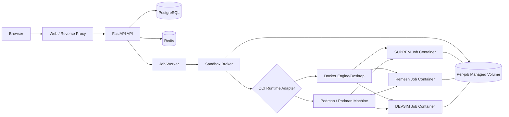
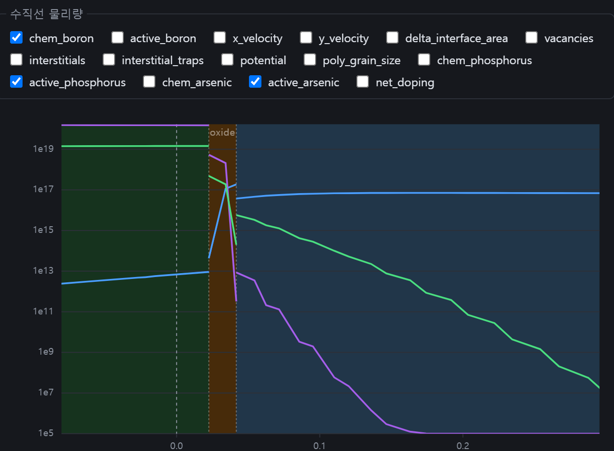
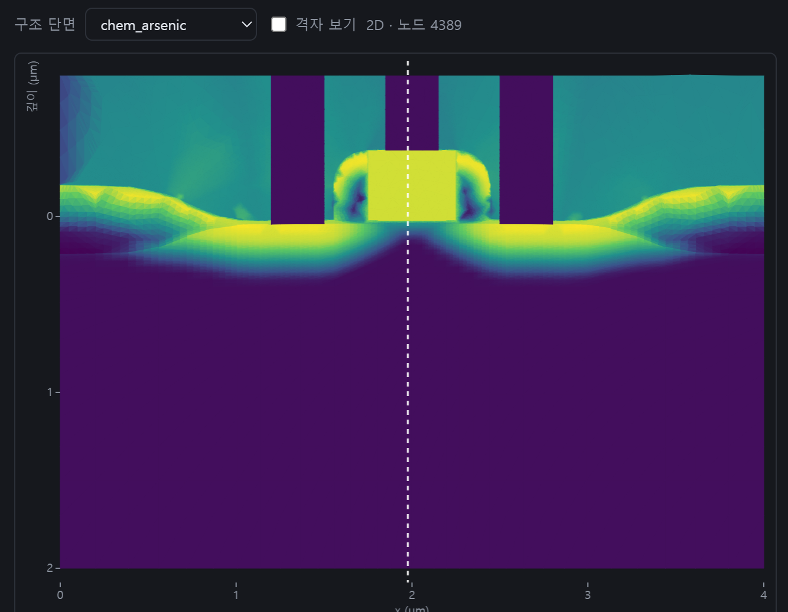
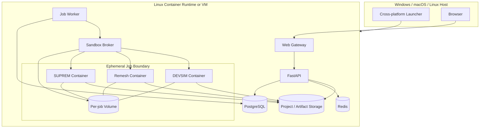
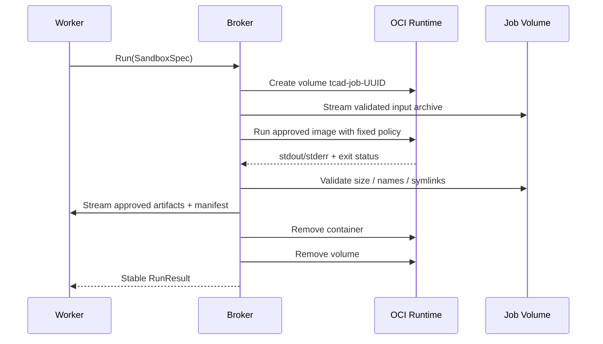

# TCAD Webapp Cross-Platform Porting — 제품·기술 기획서

> **가칭:** TCAD Webapp Portable / TCAD Local  
> **문서 상태:** Draft for Architecture Review  
> **기준일:** 2026-08-23  
> **대상 업스트림:** `https://github.com/ypooh2042/tcad-webapp` (`master`)  
> **목적:** Windows·macOS·Linux에서 안전하고 재현 가능한 로컬 서버 실행, 기존 결함 수정, 향후 솔버·후처리 확장 기반 마련

---

## 1. Executive Summary

현행 프로젝트는 브라우저에서 SUPREM-IV.GS 입력 덱을 편집·실행하고 `.str` 결과를 프로파일 및 2D 단면으로 확인한 뒤, 구조를 Gmsh로 재메시하고 DEVSIM으로 I–V 해석하는 교육용 TCAD 웹앱이다. 백엔드는 FastAPI와 별도 잡 워커, 프런트엔드는 React/Vite이며 PostgreSQL·Redis를 사용한다. 시뮬레이터는 루트리스 Podman 컨테이너에서 잡 단위로 실행된다.

포팅의 핵심은 오래된 SUPREM-IV.GS를 Windows PE 또는 macOS Mach-O로 직접 이식하는 것이 아니다. Windows와 macOS에서도 Docker Desktop 또는 Podman Machine이 Linux VM을 제공하므로, **Linux 컨테이너를 공통 실행 환경으로 유지하고 운영체제 차이는 런타임 추상화·볼륨 전송·설치 도구·진단 계층에서 해결**한다.

목표 구조는 다음과 같다.



릴리스 1.0의 성공 조건은 다음과 같다.

- 컨테이너 런타임이 준비된 Windows 11, macOS Intel/Apple Silicon, Linux x86-64에서 설치 후 단일 명령으로 로컬 UI가 열린다.
- 동일 입력의 구조 토폴로지와 핵심 공정·I–V 지표가 승인된 허용오차 안에서 일치한다.
- 사용자가 제출한 `.in`이 임의 셸로 해석될 수 있다는 현재 위협 모델을 유지하고, 패키징 편의를 위해 샌드박스 제약을 완화하지 않는다.
- 잡 종료·중단·실패·호스트 재시작 후 orphan 컨테이너·볼륨이 남지 않는다.
- 프로젝트를 `.tcadproj`로 내보내면 입력, 해석 조건, 결과, 이미지 digest, 패치셋과 수치 환경을 재현할 수 있다.
- 라이선스·NOTICE·상류 출처 정책이 명시되고, 배포 가능한 구성과 별도 설치가 필요한 구성이 분리된다.

---

## 2. 배경과 문제 정의

### 2.1 교육적 가치

상용 TCAD는 공정·소자 물리 모델, 수치 솔버, 보정 데이터, GUI, 지원 체계를 포함하므로 교육기관·개인 학습자가 접근하기 어렵다. 이 프로젝트는 오래된 오픈 소스 공정 시뮬레이터와 현대적인 웹 UI, 오픈 소스 소자 해석기를 연결해 다음 학습 흐름을 제공한다.

1. 산화·증착·식각·주입·확산 등의 공정 덱 작성
2. 단계별 `.str` 구조 변화 확인
3. 도핑·활성 도펀트·결함·전위 등 물리량 프로파일 확인
4. 2D 구조와 접촉 계면 확인
5. 전극·바이어스 설정
6. DEVSIM I–V 스윕과 결과 비교

다만 이 결과는 최신 상용 TCAD 또는 실제 공정 PDK 수준의 정확도를 목표로 하지 않는다. 제품 전반에 **“교육·구조 이해·수치 실험용이며 공정 sign-off 용도가 아님”**을 명시한다.

### 2.2 현행 사용자 경험





스크린샷 기준으로 현행 UI는 다음 강점을 갖는다.

- 다수 물리량을 선택해 로그 스케일 프로파일로 겹쳐 볼 수 있다.
- 산화막 등 재질 구간과 절단 위치를 함께 표시한다.
- 2D 삼각형 메시 기반 농도 분포를 구조 단면으로 표시한다.
- 공정 결과에서 소자 해석으로 이어지는 단일 작업 흐름을 제공한다.

포팅 과정에서는 이 시각화 경험을 유지하고, 플랫폼 진단·수치 경고·재현성 정보를 추가해야 한다.

---

## 3. 현재 저장소 기준선 분석

### 3.1 애플리케이션 구조

| 영역 | 현재 구성 | 포팅 시 판단 |
|---|---|---|
| 프런트엔드 | React 19, TypeScript, Vite, Monaco, Vitest, Playwright | 호스트 독립적. 컨테이너화와 E2E 플랫폼 행렬 보강 |
| API | FastAPI, SQLAlchemy async, Alembic | 호스트 독립적. 로컬 모드와 진단 API 추가 |
| 큐·세션 | PostgreSQL + Redis | Compose 서비스로 통합. 백업·마이그레이션 계약 필요 |
| 워커 | DB 큐 선점 후 동기 솔버 실행을 thread로 위임 | 유지. 런타임 호출을 어댑터/브로커로 교체 |
| 공정 엔진 | SUPREM-IV.GS, 1993년대 C/Fortran, 소스 빌드 + 패치 | Linux OCI 이미지 유지. amd64/arm64 자격 검증 필요 |
| 재메시 | Gmsh 별도 이미지 | 별도 프로세스 유지. GPL 의무 관리 |
| 소자 엔진 | DEVSIM 2.10.1 고정, Python 실행 스크립트 | 현재 버전을 기준선으로 유지 후 별도 업그레이드 검증 |
| 샌드박스 | 루트리스 Podman, 고정 argv, network none, read-only, non-root, 자원 상한 | 정책은 유지·강화. Podman 전용 옵션은 런타임별 변환 |
| 운영 배포 | Linux, systemd 사용자 유닛, nginx, `/srv/tcad` | 서버 프로필로 보존. 로컬 프로필과 분리 |

### 3.2 보안상 핵심 사실

SUPREM-IV.GS 인터프리터는 인식하지 못한 첫 토큰을 `/bin/bash`로 넘긴다. 따라서 사용자가 제출하는 `.in`은 단순 DSL이 아니라 **임의 셸 코드로 취급해야 한다.** 현행 코드가 사용자 입력을 argv에 넣지 않고 고정 파일명으로 기록하며, 네트워크 차단·capability 제거·읽기 전용 rootfs·비루트 UID·CPU/메모리/PID/시간·출력량 상한을 적용한 것은 포팅 과정에서 변경할 수 없는 핵심 불변식이다.

### 3.3 현재 포터빌리티 차단 요소

| ID | 차단 요소 | 영향 |
|---|---|---|
| PB-01 | `podman run`과 Podman 전용 옵션이 실행 코드에 직접 결합 | Docker Desktop 지원 불가, 테스트 대역 어려움 |
| PB-02 | `--userns keep-id`와 루트리스 pause 프로세스 복구에 의존 | Windows/macOS Podman Machine 및 Docker에서 동작 차이 |
| PB-03 | Linux systemd 사용자 유닛과 `NoNewPrivileges` 복구 시나리오가 운영 핵심 | Desktop 환경에 동일 메커니즘 없음 |
| PB-04 | 잡 작업 디렉터리를 호스트 절대경로로 bind mount | Windows 드라이브 문자, 경로 공유, 권한, 성능, symlink 처리 차이 |
| PB-05 | 로컬 실행에 DB·Redis·API·워커·Vite·세 이미지 수동 구축 필요 | 일반 사용자의 설치 실패율이 높음 |
| PB-06 | 로컬에서도 초대 코드·첫 관리자 CLI·Secure cookie 설정 필요 | 단일 사용자 로컬 UX와 맞지 않음 |
| PB-07 | SUPREM 최종 이미지가 x86-64를 전제로 설명되고 `-no-pie`로 포인터 절단 문제를 우회 | Apple Silicon 네이티브 arm64 빌드 불확실 |
| PB-08 | 수치 결과의 플랫폼 간 허용오차·골든 기준이 제품 계약으로 문서화되지 않음 | “실행됨”만 확인하고 잘못된 결과를 놓칠 위험 |
| PB-09 | 저장소에 `.github/workflows`가 없음 | PR 단계의 교차 플랫폼 회귀 검출 부재 |
| PB-10 | 루트 라이선스 부재, SUPREM 상류 라이선스가 MIT와 다름 | 재배포·상용화·사전 빌드 이미지 제공 의사결정 불가 |

### 3.4 최근 결함 패턴에서 얻는 교훈

최근 변경 이력에는 다음 유형의 실제 결함이 반복된다.

- 컨테이너 기반 복구가 특정 systemd 동작과 충돌
- 한 계면 이름의 중복이 다른 게이트를 덮어써 **오류 없이 잘못된 I–V**를 생성
- 비수렴 점이 뒤 점 전체로 전파
- 부분 편집 상태가 서버 검증에 걸려 저장이 중단
- 잡 전환 중 오래된 상태로 존재하지 않는 API 요청 반복
- 입력 컴포넌트의 중간 문자열 상태가 숫자로 즉시 변환되어 소수점·빈값 처리 실패
- E2E 자식 프로세스 stdout pipe가 차서 전체 테스트가 교착
- 오래된 C 코드의 메모리·메시·식각 영역 분할 결함

따라서 포팅은 “운영체제에서 뜨게 하는 작업”에 한정하면 안 된다. **침묵하는 수치 오류, 상태 일관성, 런타임 수명주기, 자원 누수, 과학 검증을 함께 다루는 재기반화 작업**으로 정의한다.

---

## 4. 제품 목표, 범위, 비범위

### 4.1 제품 목표

- **G1 — 설치 가능성:** 컨테이너 런타임 설치 후 저장소 clone과 한 개의 launcher 명령으로 실행
- **G2 — 플랫폼 동등성:** 지원 플랫폼에서 동일 프로젝트를 열고 공정→구조→소자 해석 흐름 수행
- **G3 — 안전성:** 악의적 `.in`이 호스트·네트워크·다른 잡·다른 사용자 데이터에 접근하지 못함
- **G4 — 재현성:** 실행 결과가 입력과 solver/runtime provenance에 연결됨
- **G5 — 오류 투명성:** 인프라 오류, 입력 오류, solver crash, non-convergence, parse 오류를 구분해 표시
- **G6 — 확장성:** 새 공정 엔진·메셔·소자 엔진·후처리기를 고정 계약으로 추가 가능
- **G7 — 유지보수성:** Docker/Podman 차이가 도메인 로직에 누출되지 않음

### 4.2 1.0 범위

- Windows 11 x64 + Docker Desktop WSL2 기본 지원
- Windows 11 x64 + Podman Machine 보조 지원
- macOS Apple Silicon + Docker Desktop 기본 지원
- macOS Apple Silicon + Podman Machine 보조 지원
- macOS Intel 유지 지원
- Linux x86-64 + rootless Podman / Docker Engine 지원
- 단일 사용자 로컬 모드와 기존 공유 서버 모드
- 공정, 재메시, DEVSIM I–V, 결과 비교, 프로젝트 export/import
- 런타임 자동 감지와 `doctor`
- 교차 플랫폼 CI 및 self-hosted qualification
- 과학 골든 코퍼스와 수치 허용오차
- 라이선스/NOTICE/SBOM/출처 문서

### 4.3 1.0 비범위

- SUPREM-IV.GS의 Windows 네이티브 `.exe` 또는 macOS 네이티브 실행파일 제공
- 3D 공정 시뮬레이션
- 최신 첨단 노드 공정 모델 또는 foundry PDK 보정
- 상용 TCAD와의 정량적 동등성 주장
- 인터넷 공개형 다중 테넌트 SaaS의 대규모 운영
- 임의 Python/DEVSIM 스크립트 업로드·실행
- 무제한 제3자 플러그인 로딩
- 기존 SUPREM 물리 모델의 대규모 재작성

---

## 5. 대상 사용자와 핵심 시나리오

### 5.1 Persona

| Persona | 요구 |
|---|---|
| 반도체 입문 학습자 | 예제에서 시작, 설치가 단순, 결과 설명과 경고가 명확 |
| 대학 수업 조교·교수 | 동일 버전 배포, 프로젝트 제출·재현, 오프라인 실행 |
| 개발자·연구자 | solver 코드·패치·파서·수치 결과를 추적, 디버그 번들 생성 |
| 소규모 연구실 관리자 | 공유 서버 모드, 초대, 정원, 리소스 상한, 백업 |

### 5.2 핵심 시나리오

1. **첫 실행:** 런타임 감지 → 이미지 확인/다운로드 → DB 마이그레이션 → 로컬 관리자 자동 생성 → 브라우저 열기
2. **예제 학습:** NMOS 예제 열기 → 공정 실행 → 마지막 구조 보기 → 도핑 프로파일 → 소자 해석 → Id–Vd 확인
3. **재현:** 프로젝트 export → 다른 OS에서 import → provenance 확인 → 승인 허용오차 안의 결과 비교
4. **오류 진단:** 컨테이너 런타임 중단 → UI가 `RUNTIME_UNAVAILABLE`로 분류 → doctor의 플랫폼별 복구 절차 제공
5. **수치 실패:** 특정 bias 비수렴 → 실패 점과 마지막 성공점 표시 → 결과 곡선의 불완전성 명시
6. **교수 배포:** 고정 릴리스와 이미지 digest를 학생에게 제공 → 동일 예제 자동 검증

---

## 6. 지원 플랫폼 정책

### 6.1 실행 모델

Windows와 macOS에서는 Linux 컨테이너가 호스트 커널에서 직접 실행되지 않는다. Docker Desktop 또는 Podman Machine이 경량 Linux VM을 제공한다. 따라서 제품 문서에서 “Windows/macOS 네이티브 지원”은 다음처럼 정의한다.

> **호스트 네이티브 UI·설치·launcher를 제공하되, solver와 서비스는 관리되는 Linux VM의 OCI 컨테이너에서 실행한다.**

### 6.2 지원 행렬

| Host | Architecture | Primary runtime | Secondary | 1.0 수준 |
|---|---:|---|---|---|
| Windows 11 | x86-64 | Docker Desktop WSL2 | Podman Machine | 정식 지원 |
| macOS 14+ | arm64 | Docker Desktop | Podman Machine | 정식 지원, SUPREM은 초기 emulation 가능 |
| macOS 13+ | x86-64 | Docker Desktop | Podman Machine | 유지 지원 |
| Ubuntu 24.04 / Debian 12 | x86-64 | rootless Podman | Docker Engine | 정식 지원 |
| Linux | arm64 | Podman/Docker | — | 실험 지원, M5 결과에 따라 승격 |

### 6.3 Apple Silicon 정책

- M0/M1 기준선은 현재와 동일한 `linux/amd64` 이미지다.
- M5에서 SUPREM C/Fortran 빌드·패치·포인터 가정·수치 결과를 arm64에서 검증한다.
- 네이티브 arm64 결과가 골든 기준을 통과하면 multi-arch manifest로 승격한다.
- 통과하지 못하면 1.0은 SUPREM만 amd64 emulation으로 실행하고, UI에 성능·지원 상태를 명시한다.
- API, 프런트엔드, PostgreSQL, Redis, Gmsh, DEVSIM은 가능한 한 네이티브 arm64 이미지를 사용한다. 단일 Compose 안에서 서비스별 platform을 다르게 지정할 수 있어야 한다.

---

## 7. Architecture Decision Records

### ADR-001 — 네이티브 solver 포팅 대신 OCI 컨테이너 포팅

- **상태:** Proposed / 우선 채택
- **결정:** SUPREM·Gmsh·DEVSIM은 Linux 이미지로 유지한다.
- **이유:** 오래된 빌드 도구·POSIX 가정·보안 격리·결과 재현성을 한 환경에 고정할 수 있다.
- **대가:** Windows/macOS에서 컨테이너 런타임과 Linux VM이 필요하다.

### ADR-002 — 런타임 중립 Sandbox Runtime 인터페이스

- **상태:** Proposed
- **결정:** 워커는 `podman` 또는 `docker` 명령을 직접 만들지 않는다. 고정된 `SandboxSpec`을 런타임 계층에 전달한다.
- **이유:** 엔진 차이를 격리하고, 정책 테스트와 mock runtime을 가능하게 한다.

### ADR-003 — Docker/Podman socket은 Sandbox Broker만 보유

- **상태:** Proposed / 보안 필수
- **결정:** API와 일반 워커가 raw engine socket에 접근하지 않는다. Broker는 승인된 이미지 digest·고정 entrypoint·고정 mount·상한만 허용한다.
- **이유:** Docker socket은 사실상 호스트 전체 제어권이다. `.in`이 임의 셸이므로 권한 경계를 좁혀야 한다.

### ADR-004 — 패키지형 로컬 모드는 잡별 managed volume 사용

- **상태:** Proposed
- **결정:** host bind mount 대신 `tcad-job-<uuid>` 볼륨을 만들고 입력을 tar stream으로 넣고 산출물을 회수한 뒤 제거한다.
- **이유:** OS 경로·파일 공유·권한·성능·symlink 차이를 제거하고 잡 간 격리를 명확히 한다.
- **예외:** 개발 프로필에서만 명시적 bind mount 허용.

### ADR-005 — 로컬 모드와 공유 서버 모드 분리

- **상태:** Proposed
- **결정:** `TCAD_MODE=local|shared|server`를 둔다.
- **보안:** 인증 생략 또는 자동 owner는 `127.0.0.1`/`::1` 바인딩에서만 허용하고, 외부 바인딩이면 부팅을 거부한다.

### ADR-006 — solver 버전 업그레이드와 포팅을 분리

- **상태:** Proposed
- **결정:** 포팅 기준선은 현행 DEVSIM 2.10.1과 현재 SUPREM 패치셋이다. DEVSIM 2.11.x 등 업그레이드는 별도 RFC·골든 검증 후 진행한다.
- **이유:** 플랫폼 변화와 수치 엔진 변화가 동시에 일어나면 원인 분리가 불가능하다.

### ADR-007 — 상류 소스와 제품 코드의 라이선스 경계를 명시

- **상태:** Blocked pending legal review
- **결정:** 앱 코드 라이선스, SUPREM 상류 라이선스, Gmsh GPL, DEVSIM Apache-2.0을 별도 NOTICE·배포 단위로 관리한다.

---

## 8. 목표 시스템 아키텍처

### 8.1 논리 구성



### 8.2 프로세스 책임

| 컴포넌트 | 책임 | 금지 사항 |
|---|---|---|
| Launcher | runtime 감지, env 생성, compose up/down, migration, browser open, doctor | solver 입력 해석, engine socket 직접 노출 |
| API | 인증·프로젝트·파일·잡 생성·결과 API | simulator 직접 실행 |
| Worker | DB 큐 선점, 상태 전이, Broker 호출, 결과 정리 | raw shell command 조립, host path 임의 전달 |
| Sandbox Broker | 이미지·볼륨·컨테이너 수명주기, 정책 강제, kill/cleanup | 사용자 지정 이미지·entrypoint·mount·network 허용 |
| Runtime Adapter | Docker/Podman API 차이 변환 | 도메인/과학 로직 포함 |
| Solver image | 고정 entrypoint로 승인된 입력만 처리 | 네트워크, host mount, runtime socket 접근 |
| Storage | 작업공간·보관 구조·결과·프로젝트 manifest | 임의 실행 파일 자동 실행 |

### 8.3 권장 저장소 구조

```text
backend/app/
  runtime/
    protocol.py          # RuntimeBackend 계약
    models.py            # SandboxSpec, RunResult, RuntimeCapabilities
    policy.py            # 공통 불변식 및 검증
    detect.py            # docker/podman 자동 감지
    docker_backend.py
    podman_backend.py
    errors.py            # 안정된 오류 코드
    transfer.py          # volume tar-in/tar-out
  broker/
    service.py
    allowlist.py
    lifecycle.py
    cleanup.py
    diagnostics.py
  system/
    doctor.py
    provenance.py
    export.py
    import_project.py
packaging/
  compose/
    compose.local.yml
    compose.shared.yml
  launcher/
    tcad.ps1
    tcad.sh
  env/
    local.example.env
  notices/
    THIRD_PARTY_LICENSES.md
    SUPREM_LICENSE.txt
    DEVSIM_NOTICE.txt
    GMSH_NOTICE.txt
.github/workflows/
  pr.yml
  images.yml
  release.yml
  numerical-baseline.yml
validation/
  corpus/
  manifests/
  comparators/
  reports/
```

폴더명은 구현 과정에서 조정할 수 있으나, **runtime policy / engine adapter / broker / domain worker의 책임 경계**는 유지한다.

---

## 9. Sandbox Runtime 계약

### 9.1 `SandboxSpec` 개념 모델

워커가 Broker에 전달할 수 있는 정보는 다음으로 제한한다.

| 필드 | 설명 | 검증 |
|---|---|---|
| `job_id` | 서버 생성 UUID | 사용자 입력 금지 |
| `kind` | `suprem`, `remesh`, `devsim` | enum |
| `image_ref` | 서버 설정의 digest-pinned 이미지 | allowlist |
| `input_manifest` | 고정 파일명과 SHA-256 | 파일 수·크기 상한 |
| `limits` | CPU, memory, pids, timeout, output | 서버 상한 이내 |
| `environment_profile` | 미리 정의된 solver env profile | 사용자 env 금지 |
| `expected_outputs` | 허용 확장자·파일명 패턴 | allowlist |

다음 값은 외부 API 또는 사용자 데이터에서 절대 받지 않는다.

- raw command / shell 문자열
- arbitrary image name
- host path
- mount option
- network mode
- privileged/capability/security option
- container user
- entrypoint

### 9.2 공통 보안 정책

모든 solver 컨테이너에 다음 정책을 적용한다.

- `network=none`
- 모든 Linux capability 제거
- `no-new-privileges`
- 읽기 전용 root filesystem
- 고정 non-root UID/GID
- `/tmp`만 제한된 tmpfs
- job volume 하나만 read-write
- CPU·memory·PID·wall-clock·출력 byte 상한
- health/timeout 이후 강제 kill
- image digest pinning
- 고정 entrypoint와 인자
- runtime socket 미마운트
- host device 미노출
- host PID/IPC/user namespace 공유 금지
- 컨테이너·볼륨에 `tcad.job_id`, `tcad.kind`, `tcad.version` label 부여

런타임별 옵션이 완전히 같지 않으면, `RuntimeCapabilities`가 지원 여부를 보고하고 **필수 정책을 구현할 수 없는 런타임에서는 실행을 거부**한다. 조용한 fallback은 금지한다.

### 9.3 잡 볼륨 수명주기



입·출력 archive는 다음을 검사한다.

- 절대경로, `..`, drive letter, UNC path 금지
- symlink, hardlink, device node, FIFO, socket 금지
- 파일 수·개별 파일·총 압축 해제 크기 상한
- 허용된 UTF-8 파일명과 고정명만 허용
- 예상 산출물 이외 삭제
- SHA-256 기록

---

## 10. 배포 프로필과 로컬 실행 UX

### 10.1 프로필

#### A. `local`

- 1인용, loopback only
- 첫 실행 시 owner 계정 자동 생성 또는 로컬 전용 one-time token
- 초대 코드 UI 비활성
- 단일 Compose stack
- 자동 browser open
- 안전한 기본 리소스: 1 concurrent job, 2 CPU, 4–6GB runtime VM 권장

#### B. `shared`

- 같은 LAN 또는 수업용 소규모 서버
- 로그인·초대·세션 정원 활성
- TLS 종단은 사용자 선택
- 2–4 concurrent jobs
- 외부 바인딩 시 강한 secret 필수

#### C. `server`

- 기존 Linux 배포 방식의 후속
- reverse proxy, HTTPS, systemd/Quadlet 또는 Compose service
- rootless Podman 우선
- 운영 로그·백업·복구·업그레이드 문서

### 10.2 launcher 명령 계약

| 명령 | 기능 |
|---|---|
| `tcad doctor` | runtime, VM, CPU/RAM, disk, architecture, images, ports, file sharing, migrations 검사 |
| `tcad up` | 안전한 env 생성, 이미지 준비, compose 실행, migration, UI 열기 |
| `tcad status` | 서비스·runtime·worker·queue·image 상태 |
| `tcad down` | 서비스 정상 종료. 프로젝트 데이터 보존 |
| `tcad reset-runtime` | orphan cleanup과 runtime 재검사. 데이터 삭제 없음 |
| `tcad backup <file>` | DB·workspace·structures·saved results·manifest 백업 |
| `tcad restore <file>` | 버전 검사 후 복원 |
| `tcad update` | 새 이미지 digest 확인, backup, migration, rollback point 생성 |
| `tcad uninstall` | 앱 컨테이너 제거. 데이터 볼륨 삭제는 별도 확인 |

Windows에서는 PowerShell, macOS/Linux에서는 POSIX shell wrapper를 제공하되, 로직은 가능한 한 공통 launcher 모듈에 둔다. 장기적으로 단일 서명 바이너리로 통합할 수 있다.

### 10.3 로컬 안전 규칙

- `TCAD_MODE=local`이면서 `TCAD_BIND`가 loopback이 아니면 startup failure
- 기본 포트 충돌 시 빈 포트를 자동 선택하고 URL을 표시
- 랜덤 secret을 최초 생성해 로컬 데이터 볼륨에 저장
- Docker/Podman Desktop이 꺼져 있으면 재시작 방법을 플랫폼별로 출력
- 이미지 pull/build 중 진행 상태 표시
- 앱 업데이트 전에 자동 backup과 migration dry-run

---

## 11. 데이터·프로젝트·재현성 설계

### 11.1 데이터 분류

| 데이터 | 수명 | 저장 위치 |
|---|---|---|
| 사용자 `.in` 소스 | 영구 | workspace/project storage |
| 임시 job input/output | 잡 수명 | per-job volume |
| 공정 `.str` 산출물 | quota/정책 | artifact storage |
| 전극 포함 대표 구조 | 영구 또는 프로젝트 수명 | structures storage |
| DEVSIM raw points | 잡 수명 + 저장 선택 | artifact / saved run |
| 저장된 I–V 결과 | 영구 | DB + result blob |
| 로그 | 정책 기반 | structured log + optional full log |
| provenance | 모든 저장 결과와 함께 | manifest |

### 11.2 `.tcadproj` 포맷

`.tcadproj`는 ZIP 컨테이너이지만 import 시 일반 ZIP으로 신뢰하지 않는다.

```text
project.tcadproj
  manifest.json
  process/
    sources/*.in
    selected-structures/*.str
  device/
    states/*.json
    saved-runs/*.json
  results/
    summaries/*.json
    plots/*.json          # 선택
  provenance/
    images.json
    patches.json
    environment.json
  logs/                   # 사용자 선택
```

### 11.3 manifest 필수 필드

- schema version
- application semantic version 및 git commit
- project UUID/name
- 생성·수정 시각
- host OS/architecture
- runtime backend/version
- 각 OCI image repo, tag, immutable digest, platform
- SUPREM upstream commit과 patchset hash
- DEVSIM/Gmsh 버전
- 입력 파일 SHA-256
- simulation spec와 단위
- 구조 node/element/region/contact counts
- 수치 결과 summary와 comparator version
- 경고, skipped points, convergence fallback 사용 횟수

### 11.4 마이그레이션 정책

- DB migration과 project schema migration을 분리
- import 시 원본 파일을 변경하지 않고 임시 staging에서 검증
- 한 번 업그레이드된 프로젝트도 원본 export를 보존
- major schema가 다르면 read-only inspection 후 명시적 변환
- solver 버전이 다른 프로젝트를 다시 실행할 때 “동일 환경 재현”과 “현재 환경 재실행”을 선택

---

## 12. 과학·수치 검증 전략

### 12.1 검증 원칙

1. **프로그램 실행 성공은 수치 성공이 아니다.** exit 0, 산출물 존재, solver convergence를 별도로 기록한다.
2. **토폴로지·단위·전극 연결은 가능한 한 exact invariant로 검증한다.** 허용오차로 덮지 않는다.
3. **플랫폼 차이는 수치 통계로 관리한다.** byte equality가 가능한 구간과 floating tolerance가 필요한 구간을 구분한다.
4. **기준선 변경은 의도된 과학 변경일 때만 허용한다.** “포팅 때문에 달라졌다”는 승인 사유가 아니다.
5. **교육용 한계와 모델 범위를 결과에 노출한다.** 최신 공정 정확도를 암시하지 않는다.

### 12.2 골든 코퍼스

| ID | 범위 | 핵심 지표 |
|---|---|---|
| PROC-1D-BORON | 1D boron diffusion | node/region 수, peak concentration, junction depth, integrated dose |
| PROC-1D-OX | oxidation | oxide thickness, interface position, dose conservation |
| PROC-IMPLANT | masked implant | mask leakage 없음, left/right dose ratio, peak depth |
| PROC-2D-NMOS | NMOS 전체 공정 | 단계 수, topology, gate oxide, S/D profile, contacts |
| PROC-2D-CMOS | 다중 마스크·다중 게이트 | 영역 분리, unique interface IDs, 두 gate 연결 |
| PARSER-STR | `.str` parser | material/region/element/contact exact mapping |
| MESH-NMOS | Gmsh remesh | orientation, invalid element count, contact preservation |
| DEV-DIODE-IV | diode | monotonicity, forward current, reverse leakage range |
| DEV-NMOS-IDVG | NMOS Id–Vg | Vth, Ion, Ioff, subthreshold slope proxy, skipped points |
| DEV-NMOS-IDVD | NMOS Id–Vd | monotonicity, saturation behavior, curve RMSE |
| DEV-CMOS-LOAD | CMOS load line | solved point ratio, crossing point, current balance |

### 12.3 비교 계층

| 계층 | 비교 방식 |
|---|---|
| L0 format | 파일 존재, schema, finite 값, 단위, 순서 |
| L1 topology | node/edge/element/region/contact count와 connectivity exact |
| L2 geometry | bounding box, material interface, oxide thickness, junction position |
| L3 field | concentration/potential의 pointwise 또는 interpolated norm, integrated quantities |
| L4 device curve | bias point 집합, convergence state, current log-RMSE, Vth/Ion/Ioff |
| L5 repeatability | 동일 이미지 5회 반복 분산, runtime 간 분산, architecture 간 분산 |

### 12.4 잠정 허용오차 정책

M1에서 실측 후 확정하며, 초기 기준은 다음과 같다.

- 같은 이미지 digest·같은 architecture: 기존에 byte-deterministic인 픽스처는 SHA-256 exact 유지
- Docker vs Podman, 같은 architecture: topology exact, 핵심 scalar relative error `<= 1e-10` 목표
- amd64 vs arm64: topology exact, 공정 scalar relative error `<= 1e-6`, I–V log-RMSE `<= 1e-3` 잠정
- 물리적으로 0에 가까운 값은 relative error 대신 absolute floor 사용
- 어느 기준을 넘더라도 자동 baseline 갱신 금지

허용오차는 “정답과의 오차”가 아니라 **승인된 기준선과의 수치 회귀 감지 기준**이다.

### 12.5 Metamorphic/Invariant tests

- implant dose 증가 시 integrated active/chemical dopant가 비정상적으로 감소하지 않음
- diffusion time 증가 시 profile 폭이 비정상적으로 축소하지 않음
- 산화 시간 양수일 때 산화막 두께가 음수가 되지 않음
- 대칭 공정의 좌우 구조 지표가 허용오차 내 대칭
- 하나의 interface key가 하나의 물리 계면만 가리킴
- 모든 electrode는 하나 이상의 실제 contact interface 보유
- 모든 bias source는 정확히 한 electrode에 귀속
- skipped/non-converged point를 solved point로 집계하지 않음
- NaN/Inf가 plot 데이터에 조용히 포함되지 않음

---

## 13. 버그 수정·안정화 프로그램

### 13.1 우선순위 정의

| 등급 | 정의 |
|---|---|
| P0-Correctness | 오류 없이 잘못된 구조·전극·I–V를 생성하거나 데이터 손실 |
| P0-Security | sandbox 탈출, runtime socket 오용, cross-job/user 접근 |
| P1-Runtime | 지원 플랫폼에서 실행·중단·복구·정리가 실패 |
| P1-Numerical | 일반 예제가 비수렴·NaN·잘못된 fallback으로 붕괴 |
| P1-Data | 저장·마이그레이션·export/import·backup 손상 |
| P2-UX | 진단 부족, 상태 race, 입력 중간 상태, 접근성 |
| P2-Performance | 불필요한 재렌더링, 큰 로그, 파일 공유 병목 |

### 13.2 결함 묶음

#### A. 침묵하는 correctness

- interface/electrode ID 중복과 map overwrite를 DB·API·UI 세 층에서 차단
- `.str` parser의 material/region/contact mapping invariant
- 공정 단계 순서가 파일명 정렬에 의해 바뀌지 않도록 source order 보존
- 단위 변환을 중앙 registry로 통합
- stale request가 다른 job/step 결과를 화면에 덮지 못하도록 request identity 검사

#### B. 수치·solver lifecycle

- bias ramp adaptive stepping의 최대 시도·최소 step·rollback 명시
- fallback tolerance 사용 횟수와 결과 warning 기록
- 한 point 실패 후 last-known-good state 복원
- remesh 전후 contact/topology 보존 검사
- timeout, SIGKILL, OOM, solver crash를 다른 오류 코드로 분류

#### C. 플랫폼·파일시스템

- CRLF→LF, UTF-8, 마지막 newline 보정
- Windows reserved name, case-insensitive collision, path length, Unicode normalization
- macOS file sharing 권한과 UID/GID 불일치
- volume export archive에서 zip-slip·symlink 차단
- runtime VM 재시작 후 stale container/volume cleanup

#### D. 데이터 손실·상태

- partial form state는 저장 가능하되 실행 시 엄격 검증
- autosave와 explicit save의 revision/ETag 충돌 검사
- DB migration rollback 및 backup restore 테스트
- project import atomic commit
- 저장된 해석 결과와 임시 잡 산출물 수명 분리

#### E. UX·진단

- 에러 배너에 stable code, 단계, 사용자 조치, diagnostics ID 표시
- runtime doctor 결과를 UI에서도 확인
- convergence 실패 점을 차트와 표 모두에 표시
- platform/emulation 상태와 교육용 한계 표시

---

## 14. 확장 아키텍처

### 14.1 Pipeline capability model

임의 플러그인을 바로 허용하지 않고, 내부 registry로 다음 역할을 분리한다.

| Role | 입력 | 출력 | 예시 |
|---|---|---|---|
| ProcessEngine | process source + params | structures + log | SUPREM-IV.GS |
| MeshEngine | structure + mesh policy | device mesh | Gmsh |
| DeviceEngine | mesh + contacts + models + sweep | solved points | DEVSIM |
| PostProcessor | artifact + view spec | profile/surface/summary | `.str` parser/plotter |
| Validator | input/output + manifest | report | golden comparator |

각 engine manifest에는 다음이 필요하다.

- stable ID/version
- supported architecture
- input/output schema
- image digest
- fixed entrypoint
- required limits
- capability flags
- license and provenance
- golden validation set

### 14.2 1.0 이후 후보

- diode/BJT/MOS capacitor 학습 템플릿
- 온도 sweep 및 AC/small-signal DEVSIM workflow
- 결과 보고서 HTML/PDF export
- parameter sweep/DOE queue
- 사용자 정의 material model은 검증된 declarative schema로 제한
- remote worker pool은 mutual TLS와 같은 broker contract를 재사용
- 교과 과정용 assignment bundle과 read-only reference result

임의 Python 업로드는 2.0 이전에 허용하지 않는다. 허용 시 별도 위협 모델과 더 강한 격리가 필요하다.

---

## 15. API 및 설정 변화

### 15.1 외부 API 후보

| Method | Path | 목적 |
|---|---|---|
| GET | `/api/system/runtime` | 선택 runtime, version, architecture, capability, image 상태 |
| GET | `/api/system/doctor` | 비밀정보를 제거한 진단 요약 |
| POST | `/api/system/doctor/run` | 관리자/로컬 owner가 명시적으로 재검사 |
| GET | `/api/jobs/{id}/diagnostics` | stable error code, phase, runtime event, provenance |
| POST | `/api/projects/{id}/export` | `.tcadproj` 생성 |
| POST | `/api/projects/import` | staging 검증 후 import |
| GET | `/api/projects/{id}/provenance` | solver/runtime/input digest |
| POST | `/api/results/{id}/compare-baseline` | 승인 comparator 실행 |

기존 API는 가능한 한 유지하고 새 필드는 additive하게 도입한다.

### 15.2 핵심 설정

| 변수 | 예시 | 규칙 |
|---|---|---|
| `TCAD_MODE` | `local` | local/shared/server |
| `TCAD_RUNTIME` | `auto` | auto/docker/podman |
| `TCAD_BIND` | `127.0.0.1` | local은 loopback 강제 |
| `TCAD_RUNTIME_SOCKET` | 내부 설정 | 사용자 입력·웹 설정 금지 |
| `TCAD_IMAGE_POLICY` | `pinned` | release는 digest 필수 |
| `TCAD_PLATFORM_POLICY` | `native-preferred` | native/amd64-emulated |
| `TCAD_JOB_VOLUME_MODE` | `managed` | release local은 managed 고정 |
| `TCAD_DIAGNOSTICS_LEVEL` | `standard` | source 내용은 기본 수집 금지 |
| `TCAD_EDUCATIONAL_BANNER` | `true` | release에서 강제 |

---

## 16. UX 요구사항

### 16.1 첫 실행/시스템 상태

- “Docker Desktop 또는 Podman Machine 준비 중”을 서비스 오류와 구분
- runtime, VM architecture, emulation 여부, image 준비 상태 표시
- 메모리 부족 시 필요한 최소/권장값과 설정 위치 안내
- local mode에서 로그인 화면 대신 owner onboarding 또는 자동 진입
- 공유 모드에서는 기존 초대·정원 흐름 유지

### 16.2 공정 화면

- 실행 전에 parser/linter warning과 shell fall-through 위험 토큰 경고
- 결과 패널에 `solver completed`, `warnings`, `recovered`, `partial artifacts`를 분리
- 각 단계의 source line과 artifact를 연결
- quantity의 단위·정의·로그/선형 scale을 표시
- 값이 0/음수/NaN이라 로그 플롯에서 제외될 때 명시

### 16.3 소자 해석 화면

- interface의 내부 stable ID와 사용자 label을 분리
- 전극·전압원 binding을 diagram과 표에서 동일하게 표시
- sweep point 수, 예상 solve 수, timeout 추정
- fallback tolerance/adaptive ramp 사용 시 warning
- non-converged point는 빈 값 또는 명시된 marker로 표시
- 저장 결과에 provenance badge와 비교 가능 여부 표시

### 16.4 교육용 표시

- 앱 footer와 결과 export에 “Educational / non-sign-off simulation” 표시
- 사용 모델·버전·제한을 열 수 있는 Model Card
- 상용 TCAD·실측 데이터와 직접 동일시하지 말라는 설명

---

## 17. QA·CI 전략

### 17.1 테스트 피라미드

1. **Static:** Python type/lint, TypeScript, dependency/license scan, Containerfile lint
2. **Unit:** parser, policy, path/archive, state transitions, UI components
3. **Contract:** Docker/Podman adapter가 동일한 `RunResult`를 반환하는지
4. **Integration:** PostgreSQL/Redis/API/worker/broker/가짜 solver
5. **Solver integration:** 실제 SUPREM/Gmsh/DEVSIM 이미지
6. **E2E:** 브라우저에서 예제 실행·중단·복구·export/import
7. **Numerical:** 골든 코퍼스와 comparator
8. **Security:** malicious deck, output bomb, zip-slip, symlink, orphan cleanup, socket boundary
9. **Platform qualification:** 실제 Windows/macOS/Linux 호스트

### 17.2 CI 행렬

| Gate | Ubuntu hosted | Windows hosted | macOS hosted | Self-hosted required |
|---|---:|---:|---:|---:|
| Lint/unit | ✓ | ✓ | ✓ | — |
| API/frontend integration | ✓ | ✓ | ✓ | — |
| Container build amd64 | ✓ | — | — | optional |
| Container build arm64 | emulated build | — | — | Apple Silicon verification |
| Real Docker E2E | ✓ | limited | limited | Windows + macOS |
| Real rootless Podman E2E | ✓ | — | — | Windows/macOS Podman Machine |
| Numerical golden | ✓ | — | — | Windows x64, macOS arm64, Linux |
| Upgrade/backup | ✓ | — | — | each supported platform before release |

GitHub-hosted runner의 VM 중첩·Docker Desktop 제약 때문에, **실제 Desktop qualification은 self-hosted 또는 수동 서명된 release checklist**가 필요하다.

### 17.3 릴리스 품질 게이트

- 모든 P0/P1 issue 종료
- 현재 테스트 + 신규 플랫폼/수치/보안 테스트 통과
- 골든 코퍼스 100% 승인
- 지원 플랫폼에서 fresh install·update·backup·restore 성공
- 20회 연속 NMOS 공정+해석 후 orphan container/volume 0
- 강제 중단·runtime 재시작·호스트 재부팅 후 상태 복구
- SBOM, image digest, source provenance, THIRD_PARTY_LICENSES 포함
- 교육용 한계와 emulation 상태가 UI/export에 표시

---

## 18. 관측성·오류 모델·진단 번들

### 18.1 Stable error taxonomy

| Code | 의미 |
|---|---|
| `RUNTIME_UNAVAILABLE` | Docker/Podman 또는 VM 미실행 |
| `RUNTIME_POLICY_UNSUPPORTED` | 필수 sandbox 기능 미지원 |
| `IMAGE_UNAVAILABLE` | 이미지 없음/pull/build 실패 |
| `SANDBOX_START_FAILED` | 컨테이너 생성 전후 인프라 실패 |
| `INPUT_REJECTED` | source/spec/archive 검증 실패 |
| `SOLVER_INPUT_ERROR` | SUPREM/DEVSIM 입력 오류 |
| `SOLVER_CRASHED` | 비정상 종료 또는 signal |
| `SOLVER_TIMEOUT` | wall-clock 상한 |
| `OUTPUT_LIMIT_EXCEEDED` | 파일/로그 출력 상한 |
| `NON_CONVERGENCE` | 일부/전체 bias point 실패 |
| `ARTIFACT_INVALID` | `.str`/mesh/result 파싱·불변식 실패 |
| `DATA_MIGRATION_FAILED` | DB/project migration 실패 |
| `INTERNAL_INVARIANT_VIOLATION` | 중복 ID·불가능 상태 등 |

### 18.2 구조화 로그

필드: timestamp, severity, service, job_id, project_id, user_id hash, phase, solver kind, runtime backend, container ID prefix, image digest, duration, error code, retry/recovery flags.

기본 로그에는 비밀번호·cookie·invite code·원본 `.in` 전체·환경 secret을 넣지 않는다.

### 18.3 Diagnostics bundle

사용자가 명시적으로 생성하는 ZIP에 다음을 포함한다.

- redacted config
- runtime/version/architecture/capability
- service status
- image digest 및 SBOM reference
- 해당 job의 단계별 event와 잘린 로그
- manifest와 입력 SHA-256
- DB schema version
- orphan 검사 결과
- 재현 명령이 아닌 재현 **절차 설명**

원본 source 포함 여부는 사용자가 별도 선택한다.

---

## 19. 라이선스·출처·배포 정책

### 19.1 현 상태의 문제

- GitHub 저장소 루트에는 현재 `LICENSE`가 없고 API metadata도 라이선스를 인식하지 않는다.
- 포함된 `SUPREM4GS/upstream/LICENSE`는 MIT가 아니다. 사용·복사·수정·배포를 허용하지만 상업적 재판매·임대·라이선스 또는 기타 상업 거래를 예외로 둔다.
- DEVSIM은 Apache-2.0이며 LICENSE/NOTICE 준수가 필요하다.
- Gmsh는 GPL v2 or later + linking exception이며 이미지/바이너리를 재배포하면 해당 의무를 검토해야 한다.
- Docker Desktop은 별도 제품이며 조직 규모·용도에 따라 구독 조건이 적용된다. 프로젝트는 Docker Desktop 자체를 번들하지 않고 설치 안내만 제공하며 Podman 대안을 유지한다.

### 19.2 선택지

#### Option A — Mixed-license source distribution

- 앱 코드에 명확한 MIT 또는 Apache-2.0 적용
- SUPREM 디렉터리와 이미지에 원 라이선스 그대로 표시
- `THIRD_PARTY_LICENSES.md`, source offer, provenance 제공
- 제품을 “MIT 프로젝트”가 아니라 “앱 코드 MIT + bundled components under their own licenses”로 설명

#### Option B — Optional SUPREM component

- 앱·DEVSIM·UI는 permissive license로 배포
- SUPREM source/image는 사용자가 별도 취득·빌드
- launcher가 checksum과 호환 버전을 검증
- 재배포 위험은 낮지만 첫 설치가 복잡해짐

#### Option C — 권리자 명시 허가

- Stanford 또는 관련 권리자에게 사전 빌드 이미지·교육/상업 배포 범위를 확인
- 허가 문서를 provenance에 보관

### 19.3 M0 필수 산출물

- `LICENSE` 또는 다중 라이선스 정책
- `THIRD_PARTY_LICENSES.md`
- `NOTICE`
- 상류 commit과 patch 목록
- 컨테이너 이미지별 포함 소프트웨어/라이선스 표
- 배포 가능한 이미지와 local build-only 이미지 구분
- README에서 “MIT 라이선스” 단일 표현 제거 또는 정확화

> 이 절은 법률 자문이 아니다. 라이선스 확정 전에는 public release image 또는 유료 서비스 계획을 승인하지 않는다.

---

## 20. 리스크 레지스터

| ID | 리스크 | 확률 | 영향 | 대응 |
|---|---|---:|---:|---|
| R-01 | SUPREM 라이선스 해석 불명확 | 높음 | 매우 높음 | M0 법률 검토, optional component/허가 선택 |
| R-02 | Apple Silicon native SUPREM 빌드 실패 | 중간 | 높음 | amd64 emulation fallback, arm64 spike 분리 |
| R-03 | Docker socket을 워커에 직접 노출 | 중간 | 매우 높음 | narrow Broker, allowlist, socket 비노출 |
| R-04 | cross-architecture 수치 차이 | 중간 | 높음 | 골든·분산 측정, 허용오차, platform provenance |
| R-05 | Desktop bind mount 성능·권한 문제 | 높음 | 중간 | per-job managed volume, WSL filesystem guidance |
| R-06 | Podman/Docker 정책 옵션 불일치 | 중간 | 높음 | capability negotiation, 필수 정책 미지원 시 fail closed |
| R-07 | 빠르게 변하는 업스트림과 fork drift | 높음 | 중간 | upstream remote, 정기 sync window, 작은 patch series |
| R-08 | 오래된 C 코드 잠복 메모리/geometry 결함 | 높음 | 높음 | sanitizer build, characterization, golden corpus, patch provenance |
| R-09 | 사용자가 교육 결과를 정밀 예측으로 오인 | 중간 | 높음 | 교육용 배너, model card, export disclaimer |
| R-10 | DB/volume update 중 데이터 손실 | 중간 | 높음 | pre-update backup, atomic migration, restore qualification |
| R-11 | self-hosted CI 운영 부담 | 중간 | 중간 | nightly qualification, signed checklist, 최소 장비 행렬 |
| R-12 | DEVSIM/Gmsh 버전 변화로 결과 변동 | 중간 | 중간 | digest pin, upgrade RFC, baseline version 분리 |

---

## 21. 비기능 요구사항

### 21.1 성능

- Linux 기준 동일 solver image의 총 시간 오버헤드: 현재 대비 `<= 20%` 목표
- Windows WSL2와 macOS native arm64: Linux baseline 대비 결과 정확성 우선, 성능은 별도 공개
- Apple Silicon amd64 emulation: 성능 SLA에서 제외하고 명시
- API 상태 조회 payload는 로그 전체를 포함하지 않음
- 구조 plot 데이터는 mtime/hash 기반 cache
- 큰 프로젝트 import/export는 streaming

### 21.2 신뢰성

- API와 worker 재시작이 진행 중 잡 상태를 모순되게 만들지 않음
- crash recovery 시 RUNNING orphan을 재조정
- 같은 job이 중복 실행되지 않음
- cancellation은 DB 상태 전이와 runtime kill 순서를 계약으로 보장
- update 실패 시 이전 release로 rollback 가능

### 21.3 보안

- local mode 외부 노출 fail closed
- secret 자동 생성 및 git 제외
- session cookie, CSRF, rate/queue limit 유지
- dependency·container vulnerability scan
- image SBOM과 signature/provenance
- import archive 공격 방어
- broker API는 loopback/Unix socket + 인증된 내부 호출만

### 21.4 접근성·국제화

- 한국어 기본, 영문 error code 병기
- 색상만으로 material/convergence 상태를 구분하지 않음
- keyboard로 주요 편집·실행·결과 탐색 가능
- 수치·단위 표기는 locale과 무관한 저장 포맷 사용

---

## 22. 성공 지표

| 지표 | 1.0 목표 |
|---|---|
| 첫 설치 | runtime 설치 완료 상태에서 15분 내 UI 접근, 수동 Python/Node 설치 없음 |
| 첫 예제 | fresh install에서 NMOS 공정→Id–Vd 완료 |
| 플랫폼 | 승인 행렬 전체 E2E 통과 |
| 수치 | 골든 코퍼스 100% 승인, 무승인 baseline 변화 0 |
| 보안 | P0 보안 이슈 0, 샌드박스 정책 테스트 100% |
| 정리 | 연속/중단/실패 20회 후 orphan container/volume 0 |
| 데이터 | export→다른 OS import→재실행 성공 |
| 진단 | 사전에 정의한 runtime fault 시나리오 전부 stable code로 분류 |
| 문서 | Windows/macOS/Linux 설치·업데이트·백업·복구 문서 완비 |
| 라이선스 | root license, NOTICE, third-party inventory, 이미지 provenance 완비 |

---

## 23. 구현 전 확정해야 할 결정

| Decision | 선택지 | 권고 |
|---|---|---|
| D-01 배포 라이선스 | mixed / optional SUPREM / explicit permission | 법률 검토 후 결정. 1차는 mixed 또는 optional |
| D-02 기본 runtime | Docker Desktop / Podman | Windows/macOS는 Docker 기본, Podman 보조 |
| D-03 Broker transport | Unix socket / loopback HTTP / engine CLI subprocess | Unix socket 또는 내부 local RPC 권고 |
| D-04 Local auth | 자동 owner / one-time token / 로그인 유지 | 자동 owner + loopback 강제 |
| D-05 Apple Silicon | native arm64 필수 / amd64 fallback 허용 | 1.0 fallback 허용, 상태 명시 |
| D-06 프로젝트 파일 | 소스만 / 결과 포함 선택 | 기본 소스+조건+provenance, 결과 선택 |
| D-07 upstream 기여 | 독립 fork / upstream PR | fork에서 안정화 후 작은 PR 단위 제안 |
| D-08 제품명 | upstream 이름 유지 / 별도 portable edition | 권리·관계를 확인하기 전 일반 명칭 사용 |

---

## 24. 근거 자료

### 현재 프로젝트

- Repository: https://github.com/ypooh2042/tcad-webapp
- README: https://github.com/ypooh2042/tcad-webapp/blob/master/README.md
- Code maps: https://github.com/ypooh2042/tcad-webapp/tree/master/docs/CODEMAPS
- Sandbox policy: https://github.com/ypooh2042/tcad-webapp/blob/master/backend/app/runner/sandbox.py
- Runtime config: https://github.com/ypooh2042/tcad-webapp/blob/master/backend/app/core/config.py
- SUPREM image: https://github.com/ypooh2042/tcad-webapp/blob/master/docker/suprem/Containerfile
- DEVSIM image: https://github.com/ypooh2042/tcad-webapp/blob/master/docker/devsim/Containerfile
- Bundled SUPREM license: https://github.com/ypooh2042/tcad-webapp/blob/master/SUPREM4GS/upstream/LICENSE

### 공식 외부 자료

- SUPREM-IV.GS Stanford documentation: https://www-tcad.stanford.edu/tcad/programs/suprem-IV.GS/Book.html
- Podman Machine: https://docs.podman.io/en/latest/markdown/podman-machine.1.html
- Docker bind mounts: https://docs.docker.com/engine/storage/bind-mounts/
- Docker volumes: https://docs.docker.com/engine/storage/volumes/
- Docker Desktop WSL best practices: https://docs.docker.com/desktop/features/wsl/best-practices/
- Docker multi-platform builds: https://docs.docker.com/build/building/multi-platform/
- DEVSIM repository: https://github.com/devsim/devsim
- DEVSIM manual: https://devsim.net/
- Gmsh license: https://gmsh.info/

---

## 25. 최종 권고

이 프로젝트의 포팅은 다음 순서가 가장 안전하다.

1. **라이선스·현행 수치 기준선·샌드박스 불변식을 먼저 고정한다.**
2. **Podman 전용 호출을 runtime interface로 분리하되 결과 동작을 바꾸지 않는다.**
3. **Docker adapter와 per-job managed volume을 추가한다.**
4. **모든 서비스를 Compose로 묶고 local mode/doctor/launcher를 제공한다.**
5. **Windows를 먼저 자격 검증한 뒤 macOS와 arm64를 분리 검증한다.**
6. **포팅과 solver 업그레이드를 섞지 않는다.**
7. **수치 기준선과 보안 게이트를 통과한 뒤에만 확장 기능을 추가한다.**

이 순서를 따르면 기존 Linux 서비스의 장점을 보존하면서, Windows/macOS 지원이 단순한 “실행 성공”이 아니라 보안·수치·데이터 재현성까지 포함하는 정식 제품 계약이 된다.
