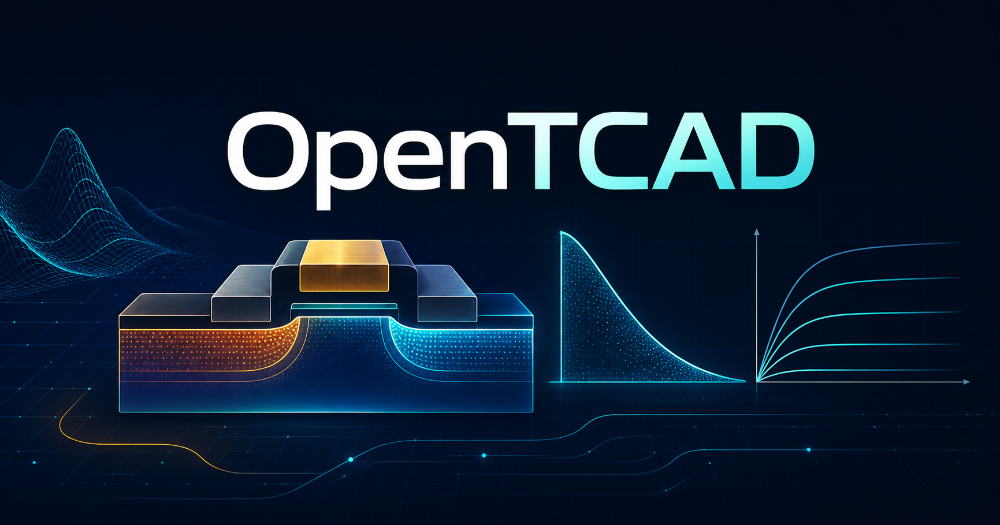

# OpenTCAD

[한국어](README.ko.md) · [Live preview](https://jtech-co.github.io/OpenTCAD/) · [Architecture](docs/en/architecture.md) · [Local service](docs/en/m3-local-service.md)



OpenTCAD is an open-source, bilingual workspace for learning semiconductor process and device simulation concepts. It connects an illustrative SUPREM-style process flow, device structure, bias conditions, and I–V behavior in one responsive web experience.

The default public experience is English. Select **한국어** at any time to switch the introduction and workspace to Korean.

> OpenTCAD is intended for education, interface exploration, and numerical experimentation. It is not a fabrication sign-off tool.

## Current release

This source builds a safe static workspace. The public preview follows the deployed `main` revision and may not yet include development-branch changes. The workspace includes:

- an English-first introduction page with a persistent Korean language option;
- process, device, curve-comparison, and runtime-boundary views;
- project-file save/import, illustrative deck diagnostics, editable bias settings, and deterministic reference visuals;
- material/terminal selection, cross-section zoom and pan, and read-only JSON/CSV result import and comparison;
- an explicitly mock-only execution, cancellation, and interruption-recovery workflow;
- explicit provenance and “not solver output” labels;
- responsive layouts, keyboard-visible focus states, and automated UI tests;
- evidence-gated Docker and Podman adapters, durable fencing, an authenticated loopback service, OS credential adapters, lifecycle integration, and scheduled backup code with Python contract tests;
- a static artifact that works under a GitHub Pages subpath or an ordinary local web server.

This build does **not** execute submitted input, containers, SUPREM-IV.GS, Gmsh, or DEVSIM. The local product connection layer is implemented but activation is fail-closed: the committed M3 manifest grants no runtime authority because native runtime, three-platform, physical power-loss, solver-license, immutable-image, SBOM, and numerical-corpus approvals are incomplete. No third-party solver source or binary is distributed in this repository.

## Explore the web app

See the [M4 workspace guide](docs/en/m4-workspace.md) for file formats, examples,
comparison rules, keyboard controls, and the M3-dependent work that remains deferred.

Open the [live preview](https://jtech-co.github.io/OpenTCAD/) or run it locally.

Requirements:

- Node.js 22 LTS or 24 LTS
- npm 10 or newer

```bash
npm install
npm run dev
```

Open the loopback URL printed by Vite. The introduction is the default route; `#workspace` opens the reference workspace directly.

To verify and preview the production build:

```bash
npm run check
npm run preview
```

The production artifact is written to `frontend/dist/`. The preview server binds to `127.0.0.1`.

To inspect M3 and run the same-origin, non-executing local preview:

```bash
npm run local:doctor
npm run local:preview
```

The preview command prints a sensitive, short-lived `browserUrl`. It creates no
broker state, reads no OS credential, and contacts no container runtime. See
[M3 local product service](docs/en/m3-local-service.md) for the product command,
configuration paths, startup order, and current activation blockers.

## Product boundary

| Surface | Available | Executes solver input |
|---|---:|---:|
| GitHub Pages introduction and workspace | Yes | No |
| Local static development and preview server | Yes | No |
| Same-origin blocked local product preview | Yes | No |
| Runtime contracts and durable local service | Implemented, gate-disabled | No |
| Connected Docker or Podman solver service | Awaiting external evidence | No |

Every visible profile, cross-section, and I–V curve is deterministic reference data. It cannot be exported as a validated result and is never presented as converged solver output.

## Repository layout

```text
frontend/              React introduction and static reference workspace
backend/app/product/   Evidence-bound product activation and exact runtime grants
backend/app/runtime/   Runtime protocol, policy, identity, and fencing contracts
backend/app/broker/    Durable state, lifecycle, recovery, archive, and backup candidates
backend/app/service/   Authenticated loopback API, worker, credentials, scheduler, product assembly
backend/tests/         Dependency-free Python contract and crash-recovery tests
validation/            External observation tools, schemas, and comparators
docs/en/               Maintained English engineering documentation
docs/ko/               Maintained Korean engineering documentation
.github/workflows/     CI and GitHub Pages deployment
```

## Quality checks

```bash
npm run check
npm run coverage
```

The full check runs Korean punctuation validation, M0 through M3 contract records, frontend lint and tests, Python runtime tests, validation tests, and the static production build. Python 3.12 through 3.14 is required for the backend test suite. Docker is not required for the published static app.

## Documentation

| English | 한국어 |
|---|---|
| [Architecture](docs/en/architecture.md) | [아키텍처](docs/ko/architecture.md) |
| [Development](docs/en/development.md) | [개발](docs/ko/development.md) |
| [Licensing](docs/en/licensing.md) | [라이선스](docs/ko/licensing.md) |
| [Implementation scope and comparison](docs/en/implementation-scope.md) | [구현 범위와 비교](docs/ko/implementation-scope.md) |
| [M3 product entry gates](docs/en/m3-entry-gates.md) | [M3 제품 진입 게이트](docs/ko/m3-entry-gates.md) |
| [M3 local product service](docs/en/m3-local-service.md) | [M3 로컬 제품 서비스](docs/ko/m3-local-service.md) |
| [Validation](validation/README.md) | [검증](validation/README.ko.md) |

## License

Original OpenTCAD application code and documentation are released under the [MIT License](LICENSE). This license does not relicense SUPREM-IV.GS, Gmsh, DEVSIM, their examples, or other upstream material. See [Licensing](docs/en/licensing.md), [THIRD_PARTY_LICENSES.md](THIRD_PARTY_LICENSES.md), and [NOTICE](NOTICE) for the distribution boundary.

Copyright © 2026 JTech-CO.
